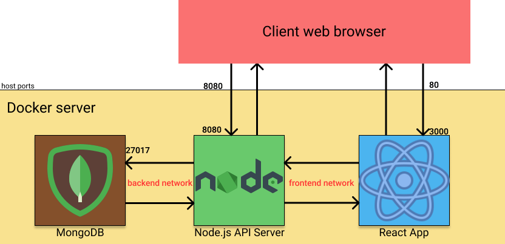

# Nardone_Enzo_B_2022_docker

# Déploiement d'une stack MERN via docker-compose

Ce projet à pour objectif de venir déployer une stack tri-partite composée d'une application frontend React.js, d'une api backend Node.js ainsi qu'une base de donnée NoSQL Mongo DB.
L'application est simple et peu interessante en elle-même, le projet se concentre sur la conteneurisation des services.

---

## DockerFiles

Vous trouverez dans les dépot ./frontend et ./backend deux dockerfiles identiques :

``` Dockerfile
FROM node:13.12.0-alpine

WORKDIR /app
ENV PATH /app/node_modules/.bin:$PATH

COPY package.json .
COPY yarn.lock .

RUN yarn install
COPY . .

CMD [ "yarn", "run", "start" ] 
```

ce Dockerfile permettra de copier ces fichiers dans une image docker, d'installer toutes les dépendences de l'application e de la démarrer au moment du lancement du conteneur.

---

## Docker-compose

à la racine du projet vous trouverez une docker-compose. son rôle est de définir les politiques de lancement de chaque conteneur et les liens qu'ils établissent entre eux.
il défini nos trois services, et pour notre backend et notre front end, vas venir build les Dockerfiles pour utiliser les images docker.

```yml
version: '3'

services:
  mongo:
    image: mongo:5.0.0
    container_name: mongo
    restart: always
    volumes: 
      - 'my-app:/data/db'
    networks:
      - backend

  backend:
    build: ./backend
    container_name: project-backend
    ports:
      - "8080:8080"
    environment:
      - MONGO_URI=mongodb://mongo:27017/dbdev
    links:
      - mongo
    depends_on:
      - mongo
    networks:
      - frontend
      - backend

  frontend:
    build: ./frontend
    container_name: project-frontend
    ports:
      - "80:3000"
    networks:
      - frontend

volumes:
  my-app:

networks:
  frontend:
    driver: bridge
  backend:
    driver: bridge
```

## Architecture projet

l'architecture se contruit donc comme suit :




## Procédure de lancement

### prerequis

- Docker with linux container installed
- Docker-compose installed

## Build

 - télécharger le dépot git
```
 docker-compose up
```
